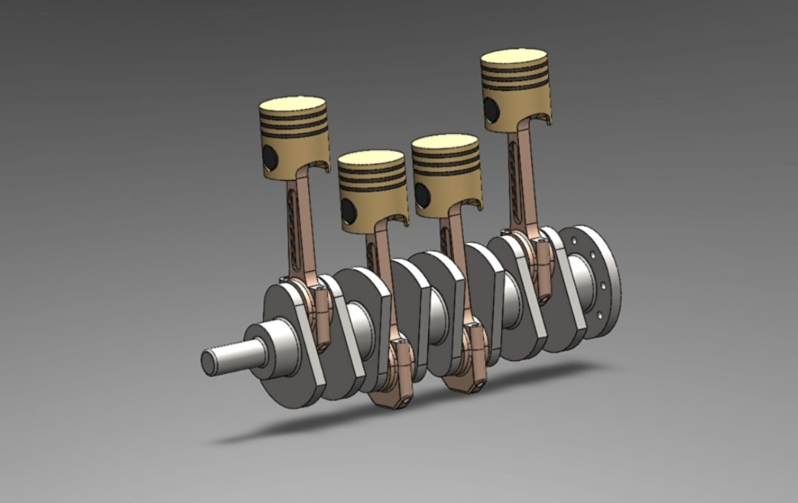

# 4-Cylinder Engine SolidWorks Model

A fully functional 3D model of a 4-cylinder internal combustion engine built using SolidWorks.  
Includes pistons, crankshaft, connecting rods, and more with motion-ready assembly.

## 📂 Project Structure 
SolidWorks_Files/ → Native SolidWorks files (.SLDPRT, .SLDASM) STL_Files/ → 3D-printable STL versions images/ → Screenshots or exploded views README.md 

## 🔧 Features

- 🧩 Fully assembled 4-cylinder engine with moving parts
- 🔄 Motion study compatible
- 🛠️ Realistic part constraints and mates
- 📏 Designed with correct proportions
- 📤 Exported formats: STL, STEP, PDF

- ## 🚀 How to Use

1. Clone or download the repository:
    https://github.com/Zoro0760/solidwork_projects
/4_cylinder_engine/
   
. Open the `.SLDASM` file in SolidWorks (2020 or later).

3. Explore or animate the model.

4. Export or modify parts as needed.

## 👤 Author

ADITHYA SHAJEE 
Mechanical Engineering Student  
[LinkedIn] (https://www.linkedin.com/in/adithya-shajee-b2732b287)
